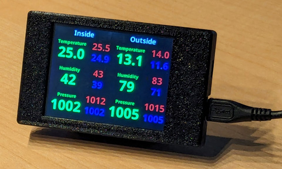

# cyd-weather

### Description

Displays indoor and outdoor temperature, humidity and pressure, showing current value and 24-hour highs and lows.

Measurements are supplied via a local MQTT server, to which they are published by e.g Home Assistant, Node-RED, etc.,
based on readings from local sensors e.g. Aqara temperature and humidity sensors.

Likely will need modifying to suit, but may be useful as an example or template for similar projects.

### Firmware

- [`TFT_eSPI` display controller driver library](https://github.com/Bodmer/TFT_eSPI)
- [`XPT2046_Touchscreen` touch controller driver library](https://github.com/PaulStoffregen/XPT2046_Touchscreen)
- [`PubSubClient` MQTT client library](https://github.com/knolleary/pubsubclient)
- [Noto fonts from Google](https://fonts.google.com/noto)

Not in the repo, `secrets.h` contains `#define`s for Wi-Fi and MQTT credentials.

### Hardware

- [Sunton ESP32-2432S028R on AliExpress](https://www.aliexpress.com/item/1005004502250619.html)
- [Enclosure for Sunton ESP32-2432S028R on Printables](https://www.printables.com/model/685845)
- [Aqara Sensor Outdoor Mount on Printables](https://www.printables.com/model/146044)

### Device

